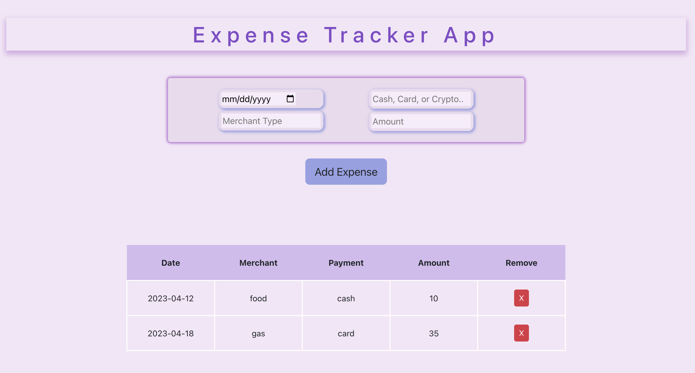

# Expense Tracker

Check out the project! [here](https://expense-tracker-by-kurtis.herokuapp.com/)

## Description

This is my first react app!

I have been exposed to react native at a previous job, so the structure of a react app was not totally foreign to me, but it did take some time for me to understand how to structure my files and components in an easy to use manner. I really enjoyed learning some "magic" react fundamentals while still building on my javascript skills.

Using Bootstrap was a nice addition to complement my CSS, and streamline some of my button styles.

What I learned

- Passing and Receiving Props
- Structuring Components
- The Table element
- useEffect() & useState()
- LocalStorage
- Bootstrap

Expense Tracker Functionality :

- Input Date, Merchant, Currency, and Amount data that is added to as a table row
- Unable to add a row if any data input is left blank
- Able to delete any of the individual rows
- User data can be stored in local storage, and retreived upon returning to the page

## Author

Kurtis Casperson
connect with me [LinkedIn](https://www.linkedin.com/feed/) !
